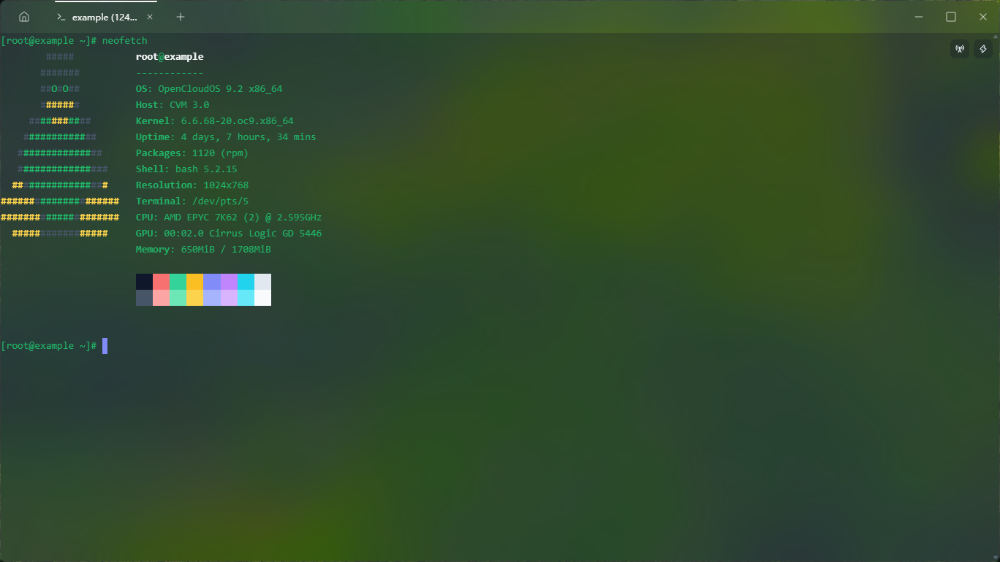

# Swallow

Cross-platform terminal client: **SSH / SFTP / Telnet / local shell / VNC remote desktop / Serial** with server monitoring, key & certificate management, ProxyJump and port forwarding.


[简体中文](README.md) · [English](README.en.md)

---

## Screenshot



## Highlights

- **Six session types, one entry** — SSH / SFTP / Telnet / local shell / VNC remote desktop (direct or over SSH tunnel) / Serial (COM / tty)
- **Security model** — passwords & passphrases live in the OS keyring (Keychain / Windows Credential Manager / Secret Service); keys & certificates are written to a temp file only for the handshake and burned afterwards — no plaintext material ever touches disk
- **Jump hosts & forwarding** — chained SSH ProxyJump; local / remote / SOCKS5 forwarding
- **Selectable terminal renderer** — DOM / Canvas / WebGL with GPU toggle, auto-fallback to Canvas
- **Agentless monitoring** — read-only over SSH, no extra dependencies on the host

## Features

### Connections & sessions
- Tabs with drag-reorder, splits, session persist & auto-restore; optional auto-reconnect
- Central management for hosts / accounts / keys / certificates / known hosts (card & list views)
- Host-key fingerprint confirmation on first connect (MITM protection)

### File transfer (SFTP / FTP)
- Dual-pane manager, recursive upload/download, resume, filename search
- Drag-drop upload, transfer queue, chmod

### Terminal
- 256-color / truecolor, configurable cursor, large scrollback
- Quick commands, SSH broadcast to multiple sessions, snippet insert
- Optional copy-on-select, middle-click paste

### Server monitoring
- Multi-host dashboard: CPU ring gauge, live sparklines, usage bars
- Detail: CPU breakdown (incl. iowait / steal), memory, top processes, disk + I/O, per-NIC speed, TCP states
- High-load color alerts, sort by load; monitor list persists and restores on launch

### Look & feel
- Dark / light / system theme, fully customizable UI palette
- 9 built-in terminal schemes; fonts, line height, cursor configurable
- Acrylic / Mica / Blur effects, transparent background, custom background image (extendable to topbar)
- zh / en UI, 3-step first-run onboarding

## Install

- **Windows** — grab `swallow_<ver>_x64-setup.exe` from Releases. On machines **without** the WebView2 runtime (usually preinstalled on Win10/11), use `*-full-setup.exe` — it embeds the offline WebView2 installer.
- **macOS / Linux** — multi-platform builds are in progress via GitHub Actions; `*.dmg` and `*.deb` / AppImage will be published to Releases once ready.

> Build from source: `pnpm install && pnpm tauri build` (see "Development").

## Data & privacy

- Data stays on this machine: settings under `%APPDATA%\Swallow`, known_hosts at `~/.ssh/known_hosts` — **no telemetry**.
- Passwords / passphrases → OS keyring; key & certificate material → SQLite, never written as plaintext files.
- Cloud sync is an optional self-hosted service in an experimental stage; most users won't need it.

## Development

```bash
pnpm install        # frontend deps (Node ≥ 20)
pnpm tauri dev      # dev mode (hot reload)
pnpm tauri build    # release bundles (exe / NSIS / MSI)
```

Verify: `cargo check` (inside src-tauri/) + `npx tsc --noEmit`.

## Roadmap

- [ ] Official macOS / Linux releases (CI wired — see `.github/workflows/release.yml`)
- [ ] Multi-window & session groups
- [ ] Custom terminal context menus & macros

## License

[MIT](LICENSE)

## Community

Join the ArHub discussion on [Linux DO](https://linux.do/) to share feedback,
report issues, and exchange extension ideas.

For Chinese speakers: 欢迎在 [Linux DO 社区](https://linux.do/) 交流 ArHub 的使用体验、问题反馈和扩展想法。
